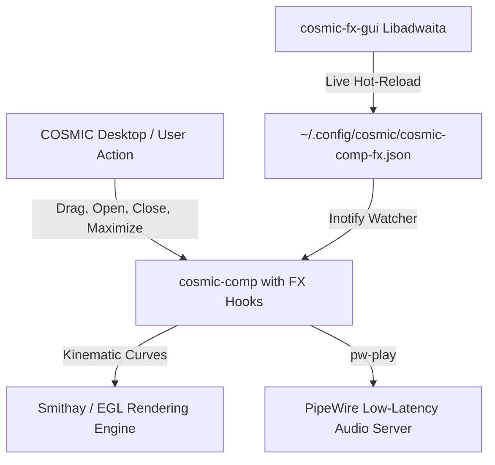

# 🌌 Cosmic FX 🫧

> **Kinematic Bubble Burst, Low-Latency Haptic Audio & Physics Engine for System76 COSMIC™**  
> *Motor de Físicas Cinemáticas, Efecto Burbuja Pop! y Retroalimentación Acústica Modular para Pop!_OS 24.04 LTS.*

[](https://system76.com/pop)
[](https://www.rust-lang.org)
[](https://github.com/pop-os/cosmic-comp)
[](https://gnome.pages.gitlab.gnome.org/libadwaita/)
[](https://pipewire.org)
[](./LICENSE)

---

**Languages / Idiomas:**  
[🇬🇧 English](#-english-documentation) • [🇪🇸 Español](#-documentación-en-español)

---

# 🇬🇧 English Documentation

## ✨ Overview
**Cosmic FX** brings back the playful, responsive, and tactile soul of desktop Linux to the next-generation **System76 COSMIC™ Wayland Compositor** (`cosmic-comp`).

Combining genuine animation kinematics (**Squash & Stretch**, anticipation dip, and buoyant leap) with a zero-latency **PipeWire acoustic engine** and a sleek **Libadwaita native control center**, Cosmic FX transforms window management into a living, organic experience.

## 🚀 Key Features
- 💥 **Kinematic POP! Bubble Burst:** Windows close with organic physics. They compress vertically (anticipation squat), burst outward symmetrically, leap upward into the air, and vaporize with a smooth quadratic alpha fade.
- 🎶 **Modular PipeWire Haptic Audio:** Ultra-low latency acoustic feedback paired symmetrically with window transitions (Open / Dock Restore, Close, Maximize / Restore floating, Minimize) with 8 selectable system tones and live preview.
- 🌊 **Wobbly Spring Physics & Card Tilt:** Fluid elastic window dragging, inertia, pendulum tilt, and active window card lift.
- 🎛️ **Native Libadwaita Control Center (`cosmic-fx-gui`):** Easily tune stiffness, damping, audio effects, and presets with one click.
- 🛡️ **Zero-Risk Rollback:** Automatically creates an immutable backup of `/usr/bin/cosmic-comp.original`. Restore vanilla Pop!_OS in 1 second.

## 📦 Installation

### Option A: Precompiled Release (Recommended)
No Rust toolchain needed:

```bash
# 1. Download release tarball
wget https://github.com/fernanditojosesanchez-source/cosmic-fx/releases/latest/download/cosmic-fx-v1.0.0-popos-x86_64.tar.gz

# 2. Extract
tar -xzvf cosmic-fx-v1.0.0-popos-x86_64.tar.gz
cd cosmic-fx-v1.0.0-popos-x86_64

# 3. Install
sudo ./install.sh
```
*Then log out and log back in to Pop!_OS.*

### Option B: Build from Source
```bash
git clone https://github.com/fernanditojosesanchez-source/cosmic-fx.git
cd cosmic-fx
./build-from-source.sh
sudo ./install.sh
```

## 🎛️ Usage
- **Open GUI:** Launch `cosmic-fx-gui` from the terminal or COSMIC App Library.
- **CLI Commands:**
  ```bash
  cosmic-fx preset snappy   # Balanced & responsive (default)
  cosmic-fx preset intense  # Maximum Compiz Boom jelly
  cosmic-fx preset subtle   # Micro-physics
  cosmic-fx preset off      # Vanilla rigid mode
  cosmic-fx status          # View active config
  ```

## 🛡️ Uninstall
To revert to the factory compositor:
```bash
sudo ./uninstall.sh
```

---

# 🇪🇸 Documentación en Español

## ✨ Descripción General
**Cosmic FX** devuelve la personalidad táctil, divertida y reactiva del escritorio Linux al compositor de nueva generación **System76 COSMIC™** (`cosmic-comp`).

Diseñado artesanalmente con principios clásicos de cinemática (**Squash & Stretch**, anticipación y salto elástico), retroalimentación acústica por **PipeWire** y una app de control en **Libadwaita / GTK4**, Cosmic FX transforma cada ventana en un elemento vivo.

## 🚀 Características Principales
- 💥 **Estallido POP! de Burbuja (Cierre):** Las ventanas no desaparecen de golpe; se comprimen elásticamente acumulando tensión, estallan asimétricamente, flotan hacia arriba en el aire y se disipan con una curva suave de desvanecimiento alfa.
- 🎶 **Orquesta Acústica Modular PipeWire:** Sonidos sincronizados con latencia imperceptible para cada etapa del ciclo de vida de la ventana:
  - **Abrir o Restaurar:** Suena al abrir una app o al desminimizarla desde el dock o panel.
  - **Maximizar o Restaurar Tamaño:** Suena al expandir a pantalla completa y al volver al tamaño flotante normal.
  - **Cerrar:** Sincronizado milimétricamente con el estallido pop.
  - **Minimizar:** Descenso suave y discreto al dock.
  - Incluye paleta de 8 tonos del sistema y botón interactivo **`▶️ Probar`**.
- 🌊 **Físicas Gelatinosas Wobbly & Inclinación 3D:** Arrastre elástico con amortiguación real, elevación de ventana y balanceo pendular por velocidad.
- 🎛️ **Centro de Control Libadwaita (`cosmic-fx-gui`):** Interfaz moderna y elegante 100% nativa en Pop!_OS 24.04 con soporte para perfiles instantáneos.
- 🛡️ **Cero Riesgo (Respaldo Inmutable):** Realiza un respaldo del compositor de fábrica en `/usr/bin/cosmic-comp.original`. Puedes volver a la versión de fábrica en 1 segundo con `sudo ./uninstall.sh`.

## 📦 Instalación

### Opción A: Paquete Precompilado (Recomendado)
Sin necesidad de instalar Rust ni esperar tiempos de compilación:

```bash
# 1. Descarga el paquete
wget https://github.com/fernanditojosesanchez-source/cosmic-fx/releases/latest/download/cosmic-fx-v1.0.0-popos-x86_64.tar.gz

# 2. Descomprime
tar -xzvf cosmic-fx-v1.0.0-popos-x86_64.tar.gz
cd cosmic-fx-v1.0.0-popos-x86_64

# 3. Instala con permisos de administrador
sudo ./install.sh
```
*Luego cierra sesión (Log out) y vuelve a entrar en Pop!_OS.*

### Opción B: Compilación desde Código Fuente
```bash
git clone https://github.com/fernanditojosesanchez-source/cosmic-fx.git
cd cosmic-fx
./build-from-source.sh
sudo ./install.sh
```

## 🎛️ Uso y Configuración
- **Interfaz Gráfica:** Ejecuta `cosmic-fx-gui` o ábrelo desde tu biblioteca de aplicaciones de COSMIC.
- **Comandos de Terminal:**
  ```bash
  cosmic-fx preset snappy   # Equilibrado y reactivo (recomendado)
  cosmic-fx preset intense  # Efecto Compiz Boom con máxima gelatina
  cosmic-fx preset subtle   # Físicas sutiles y elegantes
  cosmic-fx preset off      # Modo rígido (desactiva físicas)
  cosmic-fx status          # Muestra el estado activo
  ```

## 🛡️ Desinstalación
Para volver al compositor original de fábrica en cualquier momento:
```bash
sudo ./uninstall.sh
```

---

## 🏗️ Architecture / Arquitectura



---

## 🤝 Authors & Credits / Autores y Créditos

- **Architect & Creator:** **Fher Sánchez** ([@fernanditojosesanchez-source](https://github.com/fernanditojosesanchez-source))
- **Engineering Copilot:** **Anty** (DeepMind / Advanced Agentic AI Copilot)
- **Special Thanks:** The awesome engineering team at **[System76](https://system76.com)** for Pop!_OS and the COSMIC Desktop Environment.

---

## 📄 License / Licencia
Licensed under the **GNU General Public License v3.0 (GPL-3.0)**, matching upstream `cosmic-comp`. See [`LICENSE`](./LICENSE).
